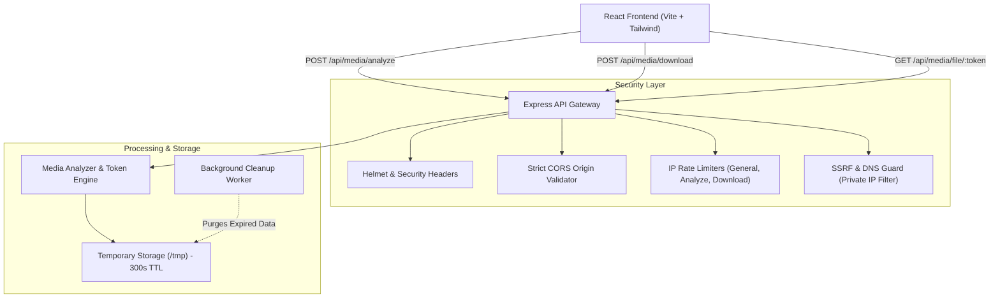

# 🚀 InstaStream — Fullstack Instagram Video Downloader

A modern, high-performance, and security-hardened Instagram video downloader web application engineered with **React, Vite, TypeScript, Tailwind CSS**, and a robust **Node.js/Express** backend.

> **Responsible Use & Compliance Notice:**
> This service is strictly intended for downloading media content that you own or have explicit legal authorization to preserve. InstaStream does not circumvent platform security, private-account restrictions, passwords, or DRM.

---

## 🌟 Key Highlights

- **⚡ Blazing Fast Architecture**: Real-time media analysis and instant video extraction.
- **🛡️ Enterprise-Grade SSRF Protection**: Strict hostname whitelisting (`instagram.com`), path pattern checks, and runtime DNS inspection to block loopback, private, and internal networks.
- **🎨 SaaS Dark Mode Aesthetics**: Sleek dark navy/purple palette, glassmorphism panels, glow accents, and responsive layout.
- **⏱️ Auto-Purge Temporary Sandbox**: All download tokens and temporary files are automatically wiped after 5 minutes (300s TTL).
- **🔒 Security Headers & Hardening**: Powered by Helmet, restrictive CORS, custom Content-Security-Policy (CSP), and tiered IP rate limiting.
- **📦 Multi-Stage Docker Setup**: Production-ready, non-root user execution, and container health checks.

---

## 🏗️ Architecture Overview



---

## 📁 Repository Structure

```text
instagram-downloader/
│
├── client/                      # React Frontend (Vite + TypeScript)
│   ├── public/                  # Static assets
│   ├── src/
│   │   ├── components/          # Reusable UI components
│   │   │   ├── Navbar.tsx       # Navigation bar with responsive drawer
│   │   │   ├── Footer.tsx       # Footer with legal statements & trust badges
│   │   │   ├── UrlInput.tsx     # Enhanced URL input with clipboard paste
│   │   │   ├── DownloadForm.tsx # Form with test reel chips & submit handler
│   │   │   ├── MediaPreview.tsx # Result card with playable preview & format list
│   │   │   ├── QualitySelector.tsx # 1080p, 720p, MP3 quality options
│   │   │   ├── DownloadButton.tsx  # Download trigger with live countdown timer
│   │   │   ├── LoadingState.tsx # Radar animation with security indicators
│   │   │   └── ErrorMessage.tsx # Sanitized user error display
│   │   ├── pages/
│   │   │   ├── Home.tsx         # SaaS landing page & hero
│   │   │   ├── Privacy.tsx      # Comprehensive Privacy Policy
│   │   │   ├── Terms.tsx        # Terms of Service & copyright guidance
│   │   │   └── NotFound.tsx     # 404 page
│   │   ├── lib/
│   │   │   ├── api.ts           # Frontend API client
│   │   │   └── validation.ts    # Frontend Zod validation
│   │   ├── types/               # TypeScript interfaces
│   │   ├── App.tsx              # Router configuration
│   │   ├── main.tsx             # Entry point
│   │   └── index.css            # Custom CSS & Tailwind utilities
│   ├── package.json
│   ├── tsconfig.json
│   └── vite.config.ts
│
├── server/                      # Node.js + Express + TypeScript Backend
│   ├── src/
│   │   ├── config/
│   │   │   └── env.ts           # Environment schema validation (Zod)
│   │   ├── controllers/
│   │   │   └── media.controller.ts # Analyze, download, and stream controller
│   │   ├── routes/
│   │   │   ├── health.routes.ts # GET /api/health
│   │   │   └── media.routes.ts  # /api/media/* routes
│   │   ├── services/
│   │   │   ├── media.service.ts # Metadata extraction and token creation
│   │   │   ├── validation.service.ts # SSRF and DNS security
│   │   │   └── cleanup.service.ts    # Background temporary file garbage collector
│   │   ├── middleware/
│   │   │   ├── error.middleware.ts    # Sanitized errors (never leak stack traces)
│   │   │   ├── rateLimit.middleware.ts# Tiered rate limiting
│   │   │   └── security.middleware.ts # Helmet, CORS, and timeout
│   │   ├── utils/
│   │   │   ├── logger.ts        # Structured JSON logger
│   │   │   └── url.ts           # Strict Instagram URL parser
│   │   ├── __tests__/
│   │   │   └── api.test.ts      # Vitest test suite
│   │   ├── app.ts               # Express configuration
│   │   └── server.ts            # Entry point & graceful shutdown
│   ├── package.json
│   └── tsconfig.json
│
├── .env.example                 # Root environment template
├── .gitignore                   # Ignore node_modules, dist, tmp, .env
├── docker-compose.yml           # Production Compose setup
├── Dockerfile                   # Multi-stage production container build
├── package.json                 # Monorepo management scripts
└── README.md                    # Project documentation
```

---

## ⚙️ Quick Start

### 1. Prerequisites
- **Node.js**: v18+ (tested on Node v20+)
- **npm**: v9+

### 2. Install Dependencies
You can install dependencies for both client and server from the root directory:
```bash
npm run install:all
```

Or individually:
```bash
cd server && npm install
cd ../client && npm install
```

### 3. Start Development Servers

**Run Server:**
```bash
npm run dev:server
# Server starts on http://localhost:5000
```

**Run Client:**
```bash
npm run dev:client
# Frontend starts on http://localhost:5173
```

---

## 🧪 Running Tests & Builds

### Run Test Suite
```bash
npm test
```
The test suite validates:
- Health check route (`/api/health`)
- Instagram URL parsing and query stripping
- Rejection of non-HTTPS protocols
- Domain whitelisting (`instagram.com` only)
- SSRF prevention & private IP detection (127.0.0.1, 10.0.0.0/8, 192.168.0.0/16, 169.254.169.254)
- Media analyze API responses and error mapping

### Run Production Build
```bash
npm run build
```

---

## 🐳 Docker Deployment

Build and launch the complete stack using Docker Compose:
```bash
docker compose up -d --build
```
The application will be accessible at `http://localhost:5000`.

---

## 📡 API Reference

### 1. Health Check
```http
GET /api/health
```
**Response (200 OK):**
```json
{
  "status": "ok",
  "timestamp": "2026-09-30T11:20:00.000Z",
  "uptime": 142.5
}
```

### 2. Analyze Instagram URL
```http
POST /api/media/analyze
Content-Type: application/json

{
  "url": "https://www.instagram.com/reel/C8XYZ123abc/"
}
```
**Response (200 OK):**
```json
{
  "success": true,
  "media": {
    "id": "550e8400-e29b-41d4-a716-446655440000",
    "shortcode": "C8XYZ123abc",
    "type": "video",
    "title": "Neon Tokyo Rain & City Lights (Creative Reel)",
    "author": "@tokyovibes",
    "thumbnail": "https://images.unsplash.com/...",
    "duration": 15,
    "formats": [
      {
        "id": "format-720p",
        "quality": "720p HD",
        "format": "mp4",
        "sizeFormatted": "12.4 MB",
        "hasAudio": true
      },
      {
        "id": "format-1080p",
        "quality": "1080p Full HD",
        "format": "mp4",
        "sizeFormatted": "24.8 MB",
        "hasAudio": true
      },
      {
        "id": "format-audio",
        "quality": "Audio Only",
        "format": "mp3",
        "sizeFormatted": "2.4 MB",
        "hasAudio": true
      }
    ]
  }
}
```

### 3. Generate Download Token
```http
POST /api/media/download
Content-Type: application/json

{
  "mediaId": "550e8400-e29b-41d4-a716-446655440000",
  "formatId": "format-1080p"
}
```
**Response (200 OK):**
```json
{
  "success": true,
  "downloadUrl": "/api/media/file/a1b2c3d4e5f6...",
  "filename": "instagram_C8XYZ123abc_format-1080p.mp4",
  "expiresIn": 300
}
```

### 4. Stream / Download File
```http
GET /api/media/file/:token
```
Streams the file with secure `Content-Disposition: attachment` headers. Expired or non-existent tokens return `404 Not Found`.

---

## 🔒 Security & Compliance Checklist

| Category | Measure | Implementation |
|---|---|---|
| **SSRF Defense** | Private IP blocklist & DNS inspection | `ValidationService.isPrivateIp` rejects `10.0.0.0/8`, `172.16.0.0/12`, `192.168.0.0/16`, `127.0.0.1`, `169.254.169.254` |
| **Domain Whitelist**| Host validation | Only `instagram.com` and `www.instagram.com` permitted |
| **Path Traversal** | Filename sanitization | Safe basename regex `[^a-zA-Z0-9_.-]` |
| **Rate Limiting** | Tiered abuse prevention | Express-rate-limit configured for API, Analyze, and Download |
| **Data Retention** | 5-minute auto wipe | `CleanupService` runs periodic cleanup of `/tmp` files and tokens |
| **Error Handling** | Sanitized responses | Never leaks stack traces or internals to the client |
| **CORS & Headers** | Restricted origins | Configured with Helmet CSP & domain-restricted CORS |

---

## 📄 License & Responsible Use

Distributed under the MIT License. Please review `Terms of Service` and `Privacy Policy` before running in production.
